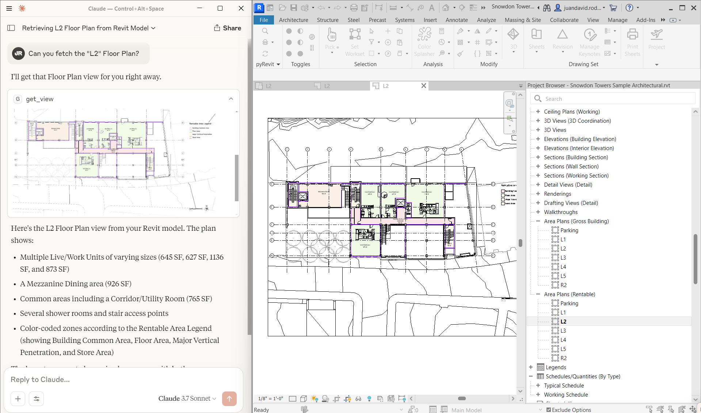

# Revit MCP Python

## A pyRevit-oriented implementation of the Model Context Protocol (MCP) for Autodesk Revit

---

## **How?**

- This minimal implementation leverages the Routes module inside pyRevit to create a bridge between Revit and Large Language Models (LLMs).
- It provides a straightforward template to get started quickly, letting you prototype and iterate tools to give LLMs access to your Revit models.
- These tools are designed to be expanded for your specific use cases. You're very welcome to fork the repo and make your own contributions.
- **Note:** The pyRevit Routes API is currently in draft form and subject to change. It lacks built-in authentication mechanisms, so you'll need to implement your own security measures for production use.

## **Batteries Included**

This repo is aimed at:
- Beginners to the Revit API
- Python specialists who aren't versed in C#
- Anyone wanting to prototype and iterate quickly with LLMs and Revit

It contains:
- A complete Routes implementation for pyRevit
- A minimal MCP server script to connect to any MCP-compatible client
- Several test commands to get you started right away

## Available Tools

The current implementation provides these key capabilities among others:

1. **Model Information** - Get comprehensive information about the Revit model:
   - Element counts by category (walls, doors, windows, etc.)
   - Room names and locations
   - Level information

2. **Get View** - Capture any Revit view for the LLM:
   - Export views as PNG images
   - Allow the model to view the image directly

3. **Family Placement** - Add elements to the Revit model:
   - Place family instances at specific coordinates
   - Set rotation and orientation
   - Apply custom properties to the placed elements

4. **Color Splash** - Visualize data through color coding:
   - Color elements by parameter values with distinct hues
   - Use gradient coloring for numerical data
   - Custom color schemes with hex values
   - Clear color overrides to restore default appearance
   - List available parameters for any category

---





## Getting Started

### Installing uv:

**Mac:**
```bash
brew install uv
```

**Windows:**
```bash
powershell -c "irm https://astral.sh/uv/install.ps1 | iex"
set Path=C:\Users\[username]\.local\bin;%Path%
```

For other platforms, see the [uv installation guide](https://docs.astral.sh/uv/getting-started/installation/).

### Setting Up the Project:

1. Fork or clone the repo: 
   ```
   https://github.com/JotaDeRodriguez/simple_revit_mcp
   ```

2. Create and activate a virtual environment:
   ```bash
   # Create virtual environment
   uv venv
   
   # Activate it (Linux/Mac)
   source .venv/bin/activate
   
   # Activate it (Windows)
   .venv\Scripts\activate
   
   # Install requirements
   uv pip install -r requirements.txt
   ```

## Installing the Extension on Revit

1. In Revit, navigate to the pyRevit tab
2. Open Settings
3. Under "Custom Extensions", add the path to the `.extension` folder from this repo
4. Save settings and reload pyRevit (you might need to restart Revit entirely)

## Testing Your Connection

Once installed, test that the Routes API is working:

1. Open your web browser and go to:
   ```
   http://localhost:48884/revit_mcp/status/
   ```

2. If successful, you should see a response like:
   ```json
   {"status": "active",
    "health": "healthy",
    "revit_available": True,
    "document_title": "your_revit_filename",
    "api_name": "revit_mcp"}
   ```

The Routes Service will now load automatically whenever you start Revit. To disable it, simply remove the extension path from the pyRevit settings.

## Using the MCP Client

### Testing with the MCP Inspector

The MCP SDK includes a handy inspector tool for debugging:

```bash
mcp dev main.py
```

Then access `http://127.0.0.1:6274` in your browser to test your MCP server interactively.

### Connecting to Claude Desktop

The simplest way to install your MCP server in Claude Desktop:

```bash
mcp install main.py
```

Or for manual installation:

1. Open Claude Desktop → Settings → Developer → Edit Config
2. Add this to the `mcpServers` section:

```json
{
  "mcpServers": {
    "Revit Connector": {
      "command": "uv",
      "args": [
        "run",
        "--with",
        "mcp[cli]",
        "mcp",
        "run",
        "/absolute/path/to/main.py"
      ]
    }
  }
}
```

## Writing Your Own Functions

What makes this implementation special is how easy it is to create new endpoints:

Define a Routes API endpoint in a module within revit_mcp (e.g., revit_mcp/my_new_feature.py).

```python
def register_function_routes(api):
    @api.route('/some_function/', methods=["GET"])
    def some_function():
        # Access the current Revit document
        doc = revit.doc
        
        # Your Revit API logic here
        value = some_action(doc)
        
        return routes.make_response(data=value)
```

Register your new module's routes in startup.py.

```python
# ... (existing imports)
from revit_mcp.my_new_feature import register_function_routes # Your new module

api = routes.API('revit_mcp')

def register_routes():
    try:
        # ... (existing route registrations)
        register_function_routes(api) # Register your new routes

        logger.info("All MCP routes registered successfully")
    except Exception as e:
        logger.error(f"Failed to register MCP routes:{str(e)}")
        raise

register_routes()
```

Create a corresponding MCP tool in `main.py`:

```python
@mcp.tool()
async def execute_function() -> str:
    """
    Description of what this tool does
    """
    try:
        url = f"{BASE_URL}/function/"
        async with httpx.AsyncClient() as client:
            response = await client.get(url)
            if response.status_code == 200:
                return response.json()
            else:
                return f"Error: {response.status_code}"
    except Exception as e:
        return f"Error: {str(e)}"
```

### Creating Actions in the Model

For operations that modify the model use POST requests with JSON payloads:

```python
def register_function_routes(api):
    @api.route('/modify_model/', methods=["POST"])
    def modify_model(doc, request):
        """Handle POST requests - for modifying the Revit model"""
        try:
            # Parse request data
            data = json.loads(request.data) if isinstance(request.data, str) else request.data
            
            # Extract parameters from the request
            operation_type = data.get("operation")
            parameters = data.get("parameters", {})
            
            # Use transaction context manager for automatic commit/rollback
            with DB.Transaction(doc, "Modify Model via MCP") as t:
                t.Start()
                
                # Your Revit API logic to modify the model
                result = perform_modification(doc, operation_type, parameters)
                
                # Transaction will automatically commit when exiting the 'with' block
                # or rollback if an exception occurs
                
            return routes.make_response(data={
                "status": "success",
                "result": result
            })
                
        except Exception as e:
            return routes.make_response(
                data={"error": str(e)},
                status=500
            )
```


```python
# and in main.py: 

# In main.py
@mcp.tool()
async def modify_model(
    operation: str,
    parameters: Dict[str, Any],
    ctx: Context = None
) -> str:
    """
    Modify the Revit model based on specified operation and parameters
    
    Args:
        operation: The type of modification to perform
        parameters: Dictionary containing operation-specific parameters
        ctx: MCP context for logging
    
    Returns:
        Success message with operation details or error information
    """
    try:
        data = {
            "operation": operation,
            "parameters": parameters
        }
        
        url = f"{BASE_URL}/modify_model/"
        ctx.info(f"Performing operation: {operation}")
        
        async with httpx.AsyncClient(timeout=30.0) as client:
            response = await client.post(
                url,
                json=data,
                headers={"Content-Type": "application/json"}
            )
            
            if response.status_code == 200:
                result = response.json()
                ctx.info("Operation completed successfully")
                return result
            else:
                error_msg = f"Error: {response.status_code} - {response.text}"
                ctx.error(error_msg)
                return error_msg
                
    except Exception as e:
        error_msg = f"Error connecting to Revit: {str(e)}"
        ctx.error(error_msg)
        return error_msg
```

## Roadmap

This is a work in progress and more of a demonstration than a fully-featured product. Future improvements could include:

- **Testing with other MCP clients and more LLMs**
- **Creating a Dockerfile for seamless installation**
- **Authentication and security enhancements**
- **More advanced Revit tools and capabilities**
- **Better error handling and debugging features**
- **Documentation and examples for common use cases**
- **...**

## Contributing

Contributions are welcome! Feel free to submit pull requests or open issues for any bugs or feature requests.
Feel free to reach out to me if you have any questions, ideas
